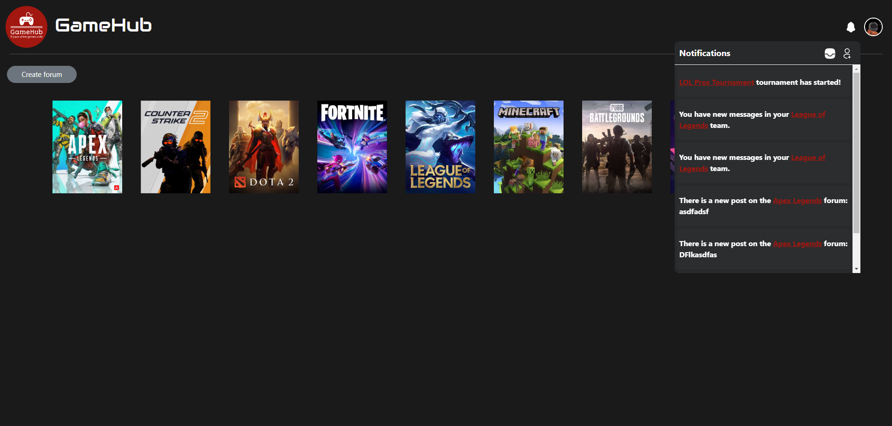
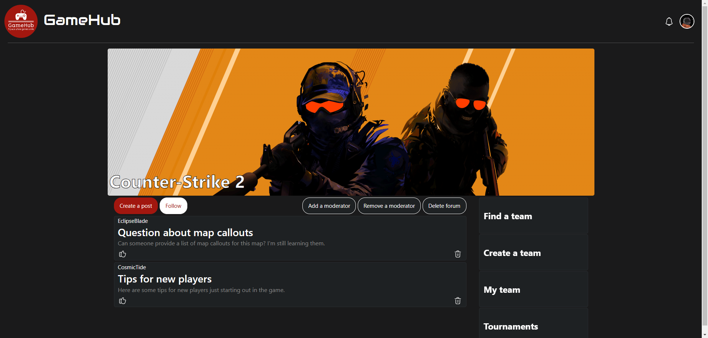
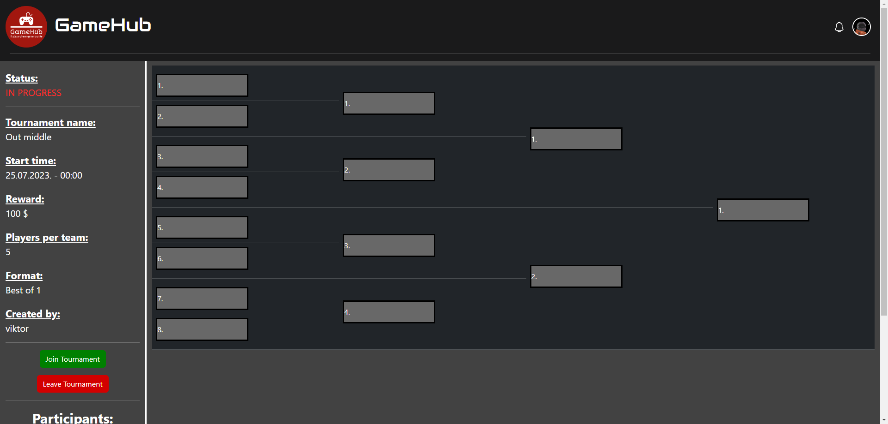

# GameHub

This project was created as part of a school assignment for 13S113PSI (Principles of Software Engineering) at School of Electrical Engineering of the University of Belgrade. Students were organized into teams and tasked with designing and creating a web app using the [Django](https://www.djangoproject.com/) framework, simulating a real-world development experience.

## Team Members

- Viktor Mitrović
- Tadija Goljić
- Nemanja Mićanović
- Mihajlo Blagojević

## Functionalities

- User creation and authentication
- User profile customization
- Admins can create forums for new games
- Users can leave posts on a forums, create or join a team, and participate in tournaments
- Users can leave comments on posts and like both posts and comments
- Teams have access to a real-time chatroom
- Users receive notifications to stay informed about events on the site

## Implementation

GameHub was made using the [Django](https://www.djangoproject.com/) framework. The real-time chatroom is powered by [Django Channels](https://github.com/django/channels), utilizing the [Daphne ASGI server](https://github.com/django/daphne) and [Redis 7](https://redis.io/). [Docker](https://www.docker.com/) was used for containerization to ensure identical development environments across collaborators. The project uses [MySQL](https://www.mysql.com/) as the database.

## Testing

Testing was done using the built-in [Django test suite](https://docs.djangoproject.com/en/5.1/topics/testing/), [Selenium WebDriver](https://www.selenium.dev/documentation/webdriver/), and [Selenium IDE](https://www.selenium.dev/selenium-ide/).
